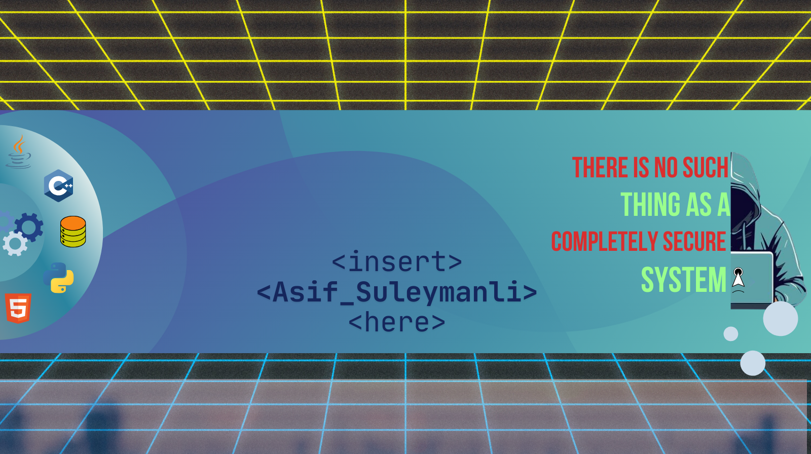

<h1 align="center">👋 Hi, I'm Asif Süleymanlı!</h1>

  

  <b>Software Engineer · Open Source Enthusiast · Problem Solver · Purple Team · Polyglot Developer · Backend Specialist</b> 
  I build robust, scalable, and maintainable software solutions with a security-first mindset. 
  <i>For me, code is a tool — the real goal is solving real-world problems and delivering meaningful impact through technology.</i>

---

## 🌐 Connect with Me

  
  
  

---

## 🚀 My Skill Set

---

## 📈 Coding Activity & Stats

  
  

  

---

## 🔝 Top Contributed Repositories

  <!-- Alternativ xidmətlər və ya statik şəkil əlavə etmək olar -->
  <!-- Aşağıda GitHub-un rəsmi "Top Languages" badge-i nümunə kimi verilmişdir -->
  

<!--
Əgər əvvəlki xidmət (github-contributor-stats.vercel.app) işləmirsə və ya xətalıdırsa, bu hissədə ya rəsmi GitHub statistika badge-lərindən, ya da alternativ xidmətlərdən istifadə edə bilərsiniz.
-->

---

## 🐍 Contribution Animation

  
  

---
## 🏆 Achievements

  

---
## 💡 How Can I Help You?

> Interested in collaborating on open-source projects, freelance work, or technical consulting?  
> Need help with coding or software development?  
> <b>Feel free to reach out via [LinkedIn](https://linkedin.com/in/asif-süleymanlı) or email: theprogrammingfather@gmail.com</b>

---

  

<!--
Professional, clean and interactive GitHub profile README by Asif Süleymanlı.
-->
